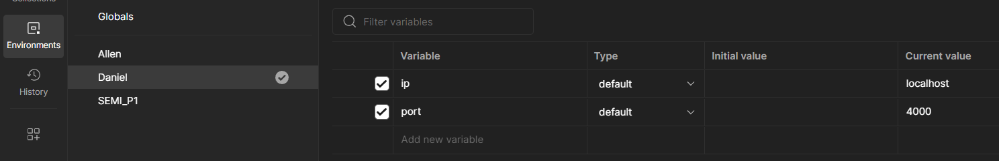
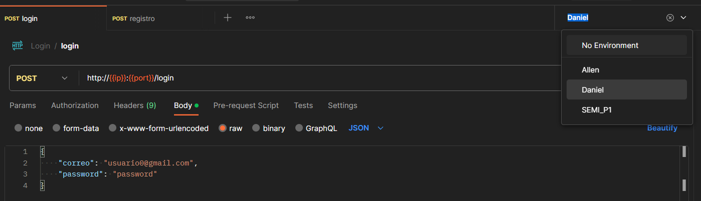
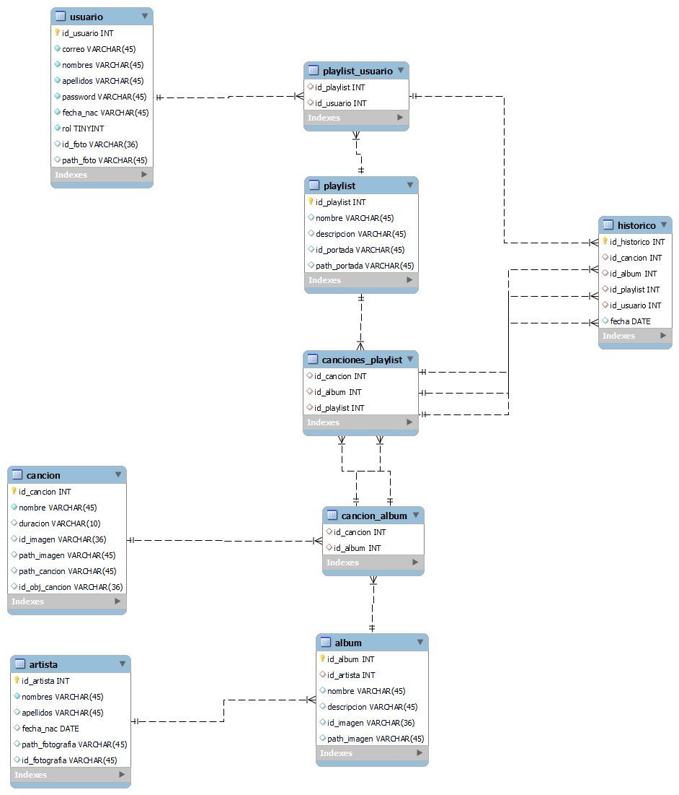

# Backend

## Documentación y pruebas API

- [`Postman`](https://app.getpostman.com/join-team?invite_code=355fa261005346408443ca2cb4290308&target_code=37291a5a4ff2e80b15463cbf1f50b8ce)

### Instrucciones

- Loguearse con una cuenta a Postman
- Ir al apartado de `Environments` y configurar sus variables

- Seleccionar su `Environment`

- Documentar cada endpoint en su categoria correspondiente y guardar los cambios

## Base de Datos

- Fue creado en mysql utilizando workbench

