# 🎶 SoundStream

<div align="center"></div>

# Manual Técnico

## ÍNDICE:

1. [Objetivos](#objetivos)
2. [Arquitectura del proyecto](#arquitectura-del-proyecto)
3. [Estructura del código](#estructura-del-código)
    - [Backend](#backend)
        - [Python](#python)
        - [NodeJS](#nodejs)
    - [Frontend](#frontend)
4. [Descripción de los servicios de AWS](#descripción-de-los-servicios-de-aws)
    - [S3](#s3)
    - [EC2](#ec2)
    - [Load Balancer](#load-balancer)
        - [Creación del Load Balancer](#creación-del-load-balancer)
            - [1. _Target Groups_](#1-target-groups)
            - [2. _Balanceador de Carga_](#2-balanceador-de-carga)
    - [RDS](#rds)
        - [Diagrama Entidad Relación](#diagrama-entidad-relación)
    - [IAM](#iam)
        - [Roles](#roles)
5. [Conclusiones](#conclusiones)

## Objetivos

### General
Brindar al desarrollador una guía para la comprensión del código y la arquitectura del proyecto.Asi mismo poder comprender como poder adaptar el proyecto a servicios en la nobe que en este caso es AWS.

### Específicos

1. Comprender la arquitectura del proyecto.
2. Comprender la estructura del código.
3. Comprender los servicios de AWS utilizados.
4. Comprender como adaptar el proyecto a servicios en la nube.

## Arquitectura del proyecto

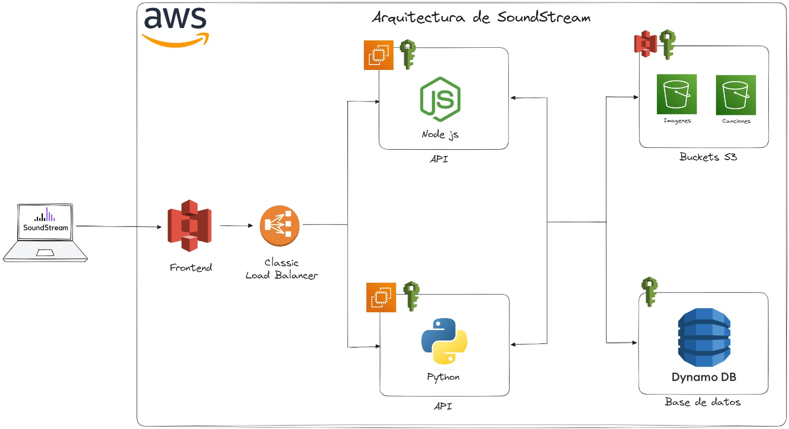

Dicha arquitectura se presenta en donde contamos con un cliente que accede al sitio web de `SoundStream` que está alojado en S3, asi tambien cualquier peticion que quiere realizar pasará por un Load Balancer que se encargará de distribuir la carga entre los servidores EC2 donde aloja uno una API desarrollada con Python y otra una API desarrollada en NodeJS, en donde se encuentran en una zona de disponibilidad, estos servidores se encargan de procesar las peticiones y de acceder a la base de datos que se encuentra en RDS.

## Estructura del código

### Backend

#### Python
<div align="center"></div>

Para la realización de la API desarrollada en Python se utilizó el framework de Flask, el cual es un framework de Python que permite la creación de API's de forma sencilla.

Para poder ejecutar el proyecto se utilizó el siguiente comando:

``` 
pyhon3 main.py 
```

Para esto se necesita haber instlado con pip3 los requerimientos que se encuentran en el archivo [`requirements.txt`](../../Backend/Python/src/requirements.txt).

Puede ubicar el código del Backend desarrollado en Python se encuentra en la carpeta [`Python`](./../../Backend/Python) en donde se encuentra la carpeta [`src`](./../../Backend/Python/src) en donde se encuentra el código de la API.

Este proyecto se encuentra corriendo en un servidor EC2 en la zona de disponibilidad `us-east-1a` en el puerto `4000`.

- Para el uso de la base de datos se utilizó la librería de mysql-connector-python.
- Para el manejo de objetos S3 se utilizó la librería de boto3.
- Para el manejo de los endpoints se utilizó la librería de Flask con Blueprint para poder separar los endpoints por archivos.

#### NodeJS
<div align="center"></div>

Descripcion xd

### Frontend

#### Reactjs
<div align="center"></div>

Para la realización de la interfaz por la parte del cliente se utilizó la librería de ReactJS la cual es una librería de JavaScript que permite la creación de interfaces de usuario de forma sencilla, y se creó el entorno de desarrollo utilizando Vite.

Para poder crear el proyecto de ReactJS se utilizó el siguiente comando:
```bash
npm create vite@latest
```

Para poder correr el proyecto en entorno de desarrollo se utilizó el siguiente comando:

```bash
npm run dev
```

Puede ubicar el código en la carpeta [`Frontend`](./../../Frontend) en donde se encuentra la carpeta [`src`](./../../Frontend/src) en donde se encuentra el código de la interfaz.

Este proyecto se encuentra alojado en S3. Y se compone por distintos componentes, pages, context, hooks, etc.

Para el uso de estilos se utilizó la librería de TailwindCSS.

Para el uso de iconos se utilizó la librería de HeroIcons y ReactIcons.

Para el uso de rutas se utilizó la librería de ReactRouter la cual cuenta con las rutas de los distintos componentes en el siguiente [enlace](./../../Frontend/src/router/index.jsx).

## Descripción de los servicios de AWS
<div align="center"></div>

Para la realización de este proyecto se utilizó el proveedor de servicios en la nube de AWS, en donde se utilizó los siguientes servicios:

### S3
<div align="center"></div>

Descripción xd

#### Buckets

- `multimedia-semi1-g8-2s2023`:

- `sound-stream-semi1-g8`: Bucket en donde se encuentra alojado el proyecto de ReactJS y donde estará expuesto el link a todo publico.

### EC2
<div align="center"></div>

Amazon Elastic Compute Cloud (Amazon EC2) fue utilizado en nuestro proyecto para poder alojar los servidores en donde se alojan las API's desarrolladas en Python y NodeJS. Asi mismo tambien se utilizó para recibir las peticiones del Load Balancer y poder acceder a la base de datos de RDS.

#### Instancias

- `EC2-1`: En esta instancia se aloja la API desarrollada en Python, que es ejecutada en el puerto 4000 y se encuentra en la zona de disponibilidad `us-east-1a`.

- `EC2-2`: En esta instancia se aloja la API desarrollada en NodeJS, que es ejecutada en el puerto 4000 y se encuentra en la zona de disponibilidad `us-east-1a`.

#### Creación de Instancias

##### 1. _Instancias_
Para comenzar con la configuración de las instancias, primeramente se accedió a la cuenta - lo que llevó a la página de inicio de la Consola:
<br>
<div align="center">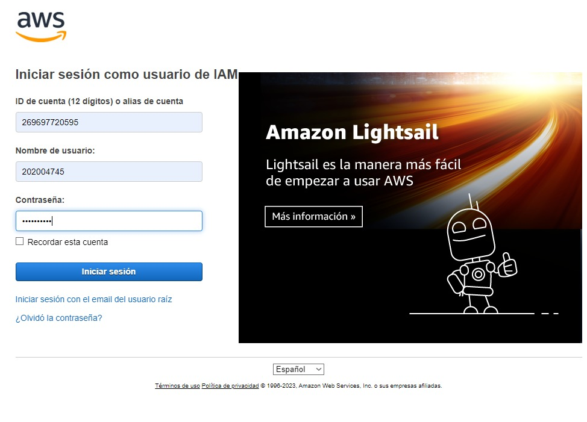</div>

Una vez accedido, se ingresó al servicio de EC2:


Se busca en el Panel de Navegación de la izquierda la opción de `Instancias` y se selecciona la opción de `Lanzar Instancia`:
<div align="center">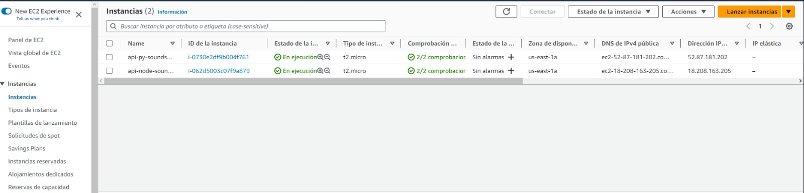</div>

###### Se configuraron las instancias de la siguiente manera:

Se ingresa el nombre de la instancia:
<div align="center">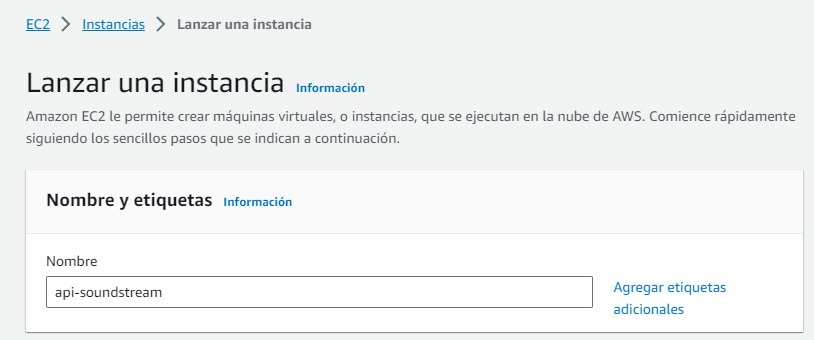</div>

Se selecciona la imagen de la máquina en este caso Ubuntu y se selecciona la versión 22.04 LTS, se selecciona la arquitectura de la máquina en este caso x86 (Free Tier):
<div align="center">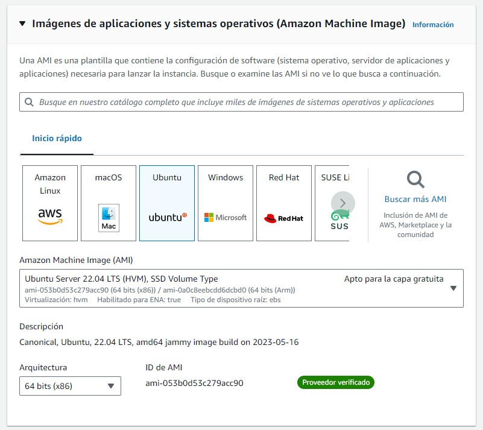</div>

Se selecciona el tipo de instancia, en este caso se seleccionó `t2.micro` y se crean claves SSH para poder acceder a la instancia:
<div align="center">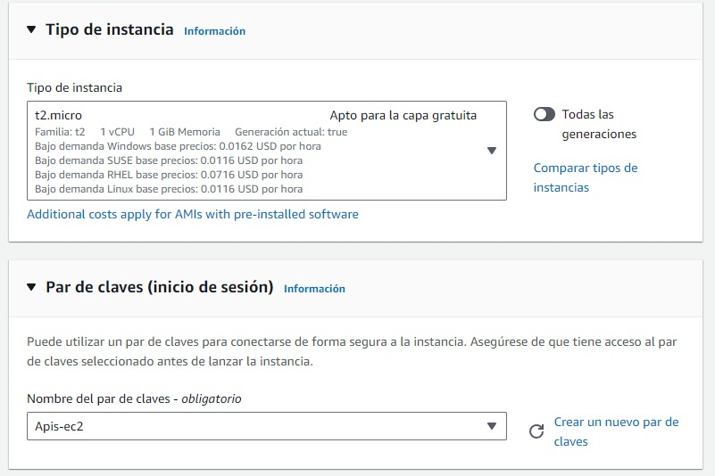</div>

Elegimos el número de instancias que queremos crear, en este caso se creó 2 instancias y se revisa la configuración de las instancias:
<div align="center"></div>

Luego de esto se crea el grupo de seguridad para poder acceder a las instancias y se le asignó el puerto 4000 para poder acceder a las instancias:
<div align="center">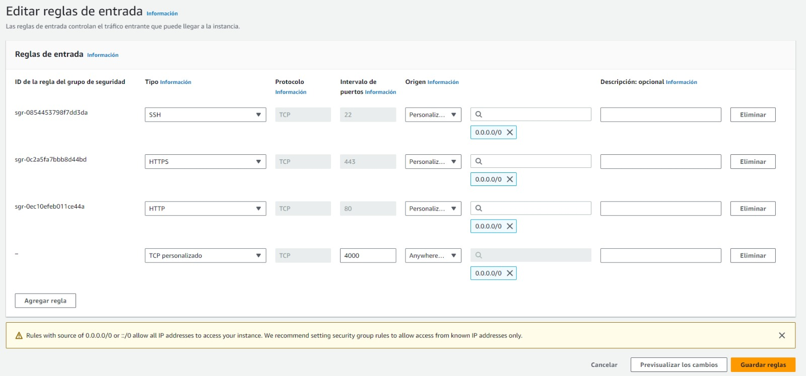</div>


### Load Balancer
<div align="center"></div>

Una de las características de la aplicación es que posee los 2 servidores los cuales se explicaron anteriormente en la sección de `EC2`. Ya que dichos servidores necesitan una manera de verificar su estado, se utilizó lo que es un *`Load Balancer`*. Amazon AWS nos provee con un el servicio de _Elastic Load Balancing_, este es el que distribuye el tráfico entrante de varios destinos al igual que realizar la dicha monitorización del estado de los destinos que se registran y logra enrutar el tráfico a los destinos con buen estado. 
<br>
La realización de este se muestra a continuación:
<br>

#### Creación del Load Balancer
Para comenzar con la configuración del Load Balancer, primeramente se accedió a la cuenta - lo que llevó a la página de inicio de la Consola:
<br>

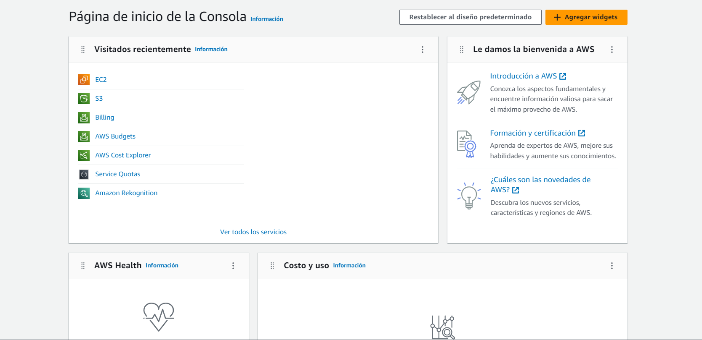
<br>

Una vez accedido, se ingresó al servicio de EC2:
<br>


<br>

#### 1. _Target Groups_
Primeramente se tuvo que fefinir el grupo de destino para saber a donde se dirigirá el tráfico. Para esto se ingresó a: `EC2 > Grupos de Destino` lo que nos presentó el siguiente panel:

<br>


<br>

Luego, al seleccionar la opción de `Crear grupo de destino` se configuró de la siguiente manera:

<br>


<br>

> Se seleccionó un tipo destino como 'Instancias'

<br>

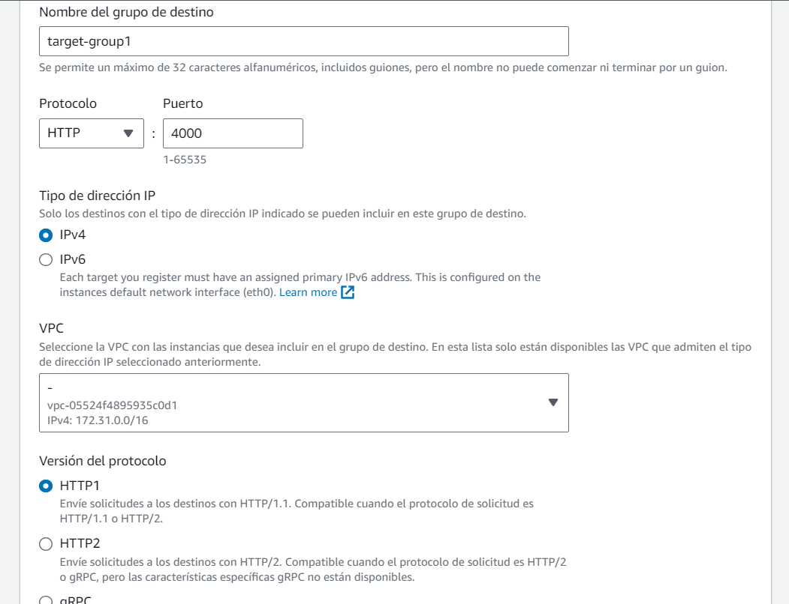

<br>

> Se definió el Nombre del grupo destino como 'target-group1', se seleccionó el protocolo HTTP y el puerto 4000, ya que es el puerto en el que se ejecutan las API de NodeJS y Python. Tipo de direcciones IP como IPv4 y se seleccionó el VPC en el que se encuentran las instancias. Versión de protocolo como HTTP1.

<br>


<br>

> Se definió comprobaciones de estado con la ruta /ping.

<br>

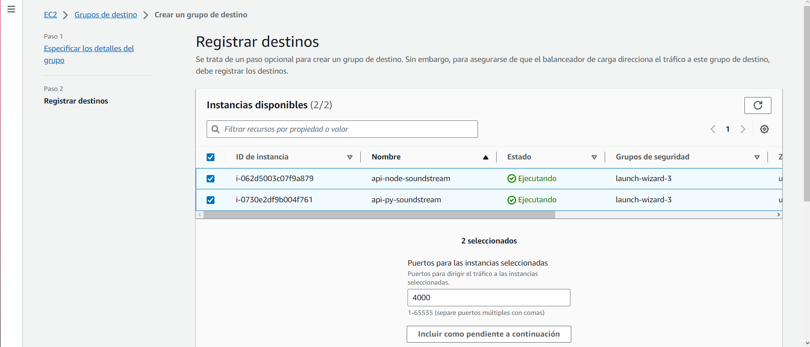

<br>

> Por último, se registraron los destinos, en este caso las instancias que se crearon anteriormente.

<br>

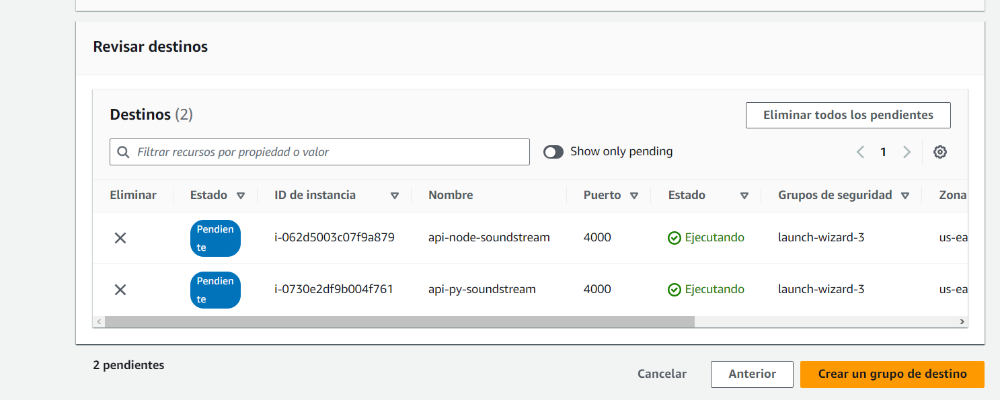

<br>

> En base a lo creado, se revisaron los destinos por última vez y se creó el grupo de destino.

<br>


##### 2. _Balanceador de Carga_
En recursos, se ingresó de la siguiente manera:  `Recursos > Balanceadores de Carga`
<br>

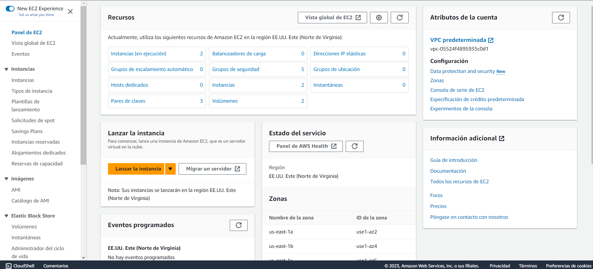
<br>

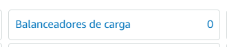
<br>

Dichas acciones nos redireccionó hacia el panel de Balanceadores de Carga:
<br>


<br>

Luego, se seleccionó la opción de `Crear balanceador de carga`:
<br>

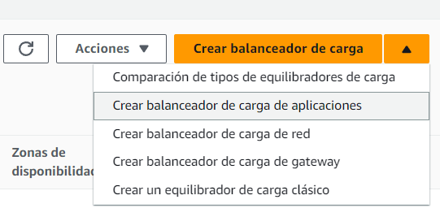
<br>

Una vez dentro, se seleccionó según las opciones que AWS provee, el tipo de equilibrador de carga, en este caso se seleccionó `Balanceador de carga de aplicaciones` esto porque se necesita un balanceador de carga que pueda enrutar el tráfico HTTP y HTTPS a los destinos de Amazon EC2, en donde se ejecutan los servidores.
<br>

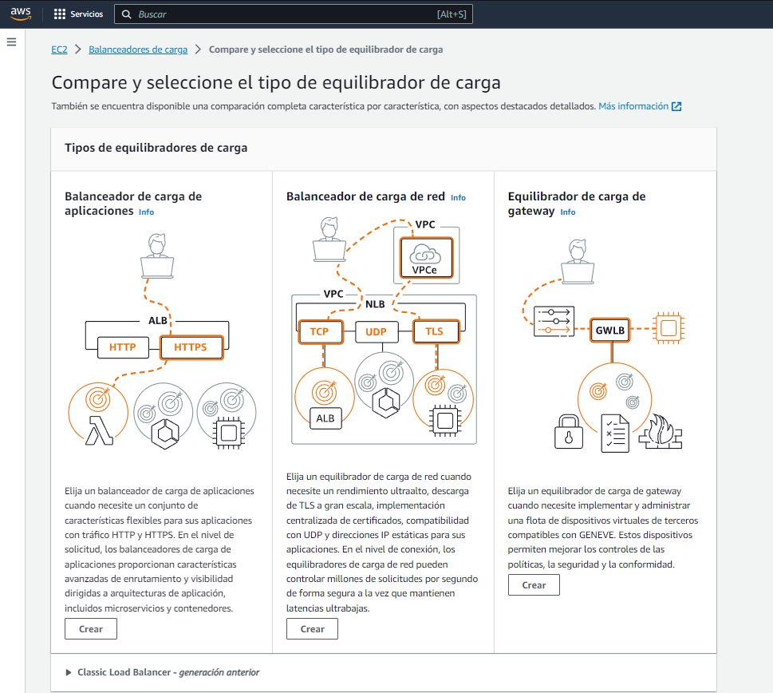

<br>
Una vez seleccionado, se especificaron los detalles del grupo de la siguiente manera:

<br>


<br>

> El nombre del load balancer se definió como _load-balancer-g8_ con un esquema expuesto a internet y tipo de direcciones IPv4.

<br>

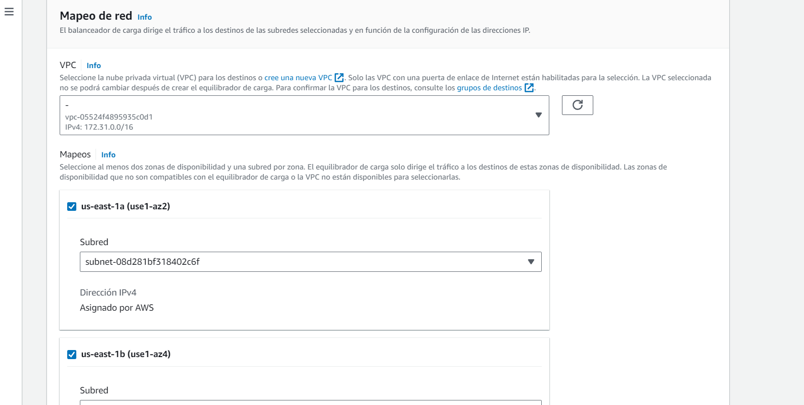

<br>

> Se eligió en el mapeo de red la VPC donde se encuentran las instancias y de Mapeo 3 zonas de disponibilidad.

<br>

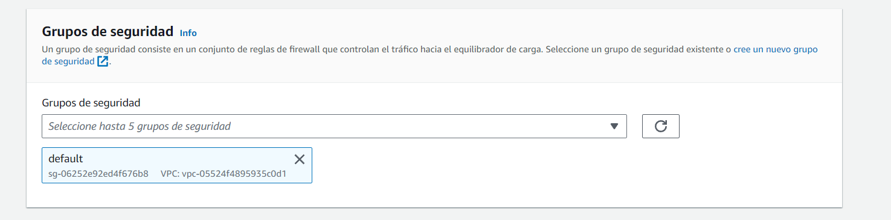

<br>

> Grupo de seguridad default.

<br>


<br>

> Se seleccionó el grupo de destino creado anteriormente.

<br>

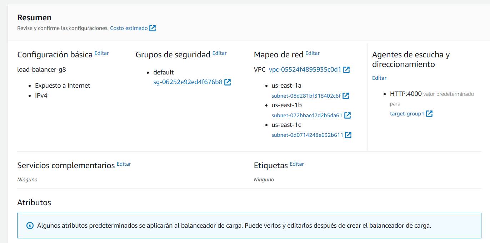

<br>

> Se presenta el resumen de las configuraciones.

<br>

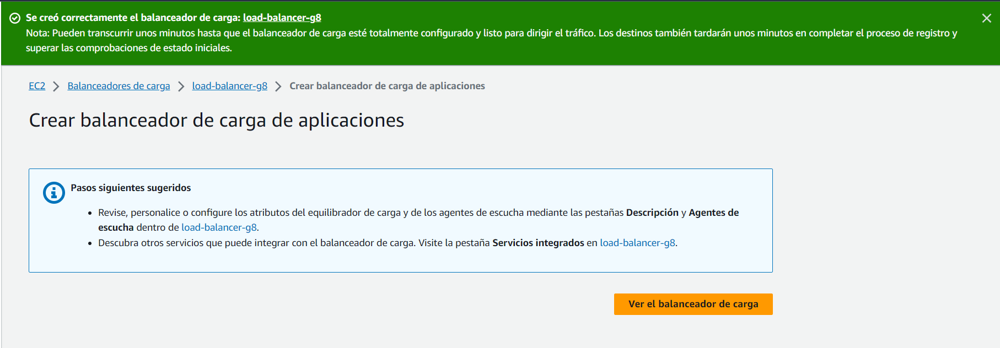

<br>

> Se guardó el balanceador de carga.

<br>


### RDS
<div align="center"></div>

Descripción

#### Diagrama Entidad Relación

Descripción

### IAM
<div align="center"></div>

Para poder realizar la conexión entre los servicios de AWS se utilizó IAM, en donde se crearon distintos roles para poder acceder a los distintos servicios. Asi mismo tambien se crearon distintos usuarios para poder acceder a los distintos servicios dependiendo del rol que desempeñaran en el desarrollo. A si mismo a cada desarrollador se le asigno un usuario con un rol especifico para poder acceder a los servicios que necesitaban para el desarrollo.

#### Usuarios

Se crearon los siguientes usuarios con los números de carnet de los desarrolladores:

- `201900042`
- `201901772`
- `202004745`
- `202010918`

<div align="center"></div>

#### Grupos de Usuarios

- `Administrador`: Los usuarios que tengan acceso a este grupo contarán con el acceso a todos los servicios de AWS, asi mismo tambien tienen control a todos los servicios de AWS.

    Cuenta con los siguientes permisos:
    - AdministratorAccess

    <div align="center"></div>

    Los usuarios que cuentan con este permiso son los siguientes:
    - `201900042`

    

- `Backend-devs`: Los usuarios que tengan acceso a este grupo contarán con el acceso a los servicios de EC2, IAM, Load Balancer, S3 y RDS.

    Cuenta con los siguientes permisos:
    - AmazonEC2FullAccess
    - AmazonRDSFullAccess
    - AmazonS3FullAccess
    - IAMFullAccess
    - ElasticLoadBalancingFullAccess

    <div align="center"></div>

    Los usuarios que cuentan con este permiso son los siguientes:
    - `201901772`
    - `202004745`

    

- `Frontend-devs`: Los usuarios que tengan acceso a este grupo contarán con el acceso a los servicios de S3 E IAM.

    Cuenta con los siguientes permisos:
    - AmazonS3FullAccess
    - IAMFullAccess

    <div align="center"></div>

    Los usuarios que cuentan con este permiso son los siguientes:
    - `201900042`
    - `202010918`

    

## Conclusiones

1.  La comprensión de la arquitectura del proyecto es esencial para el éxito en su implementación y mantenimiento.El tener una arquitectura definida proporciona una base sólida para trabajar efectivamente en el proyecto. Sabiendo como se organiza el proyecto, nos permite identificar áreas de mejora y aplicar buenas prácticas de programación. Esto se traduce en un código más limpio, menos propenso a errores y más fácil de mantener.

2. La estructura del código es fundamental para la legibilidad, la colaboración y el mantenimiento eficiente. 

3.  La utilización de servicios en la nube, específicamente los proporcionados por AWS, ha demostrado ser una estrategia efectiva para aprovechar los beneficios que la capa gratuita nos provee, igualmente nos permitió aprender sobre nuevas tecnologías y servicios que nos ayudarán en el futuro.

4.  Se concluye que el uso de los servicios en la nube puede aportar ventajas significativas en términos de rendimiento y disponibilidad. Sin embargo, es importante tener en cuenta que la implementación de una aplicación en la nube requiere un conocimiento profundo de la arquitectura de la aplicación y de los servicios en la nube.