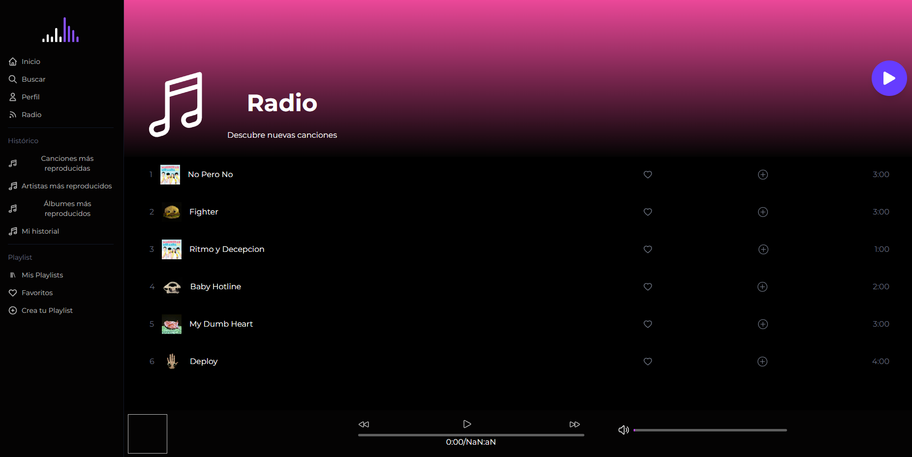
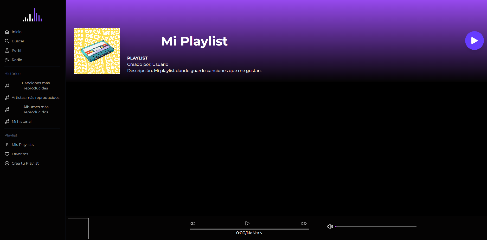
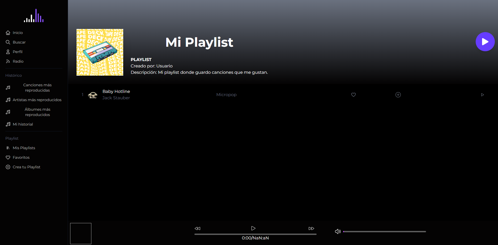
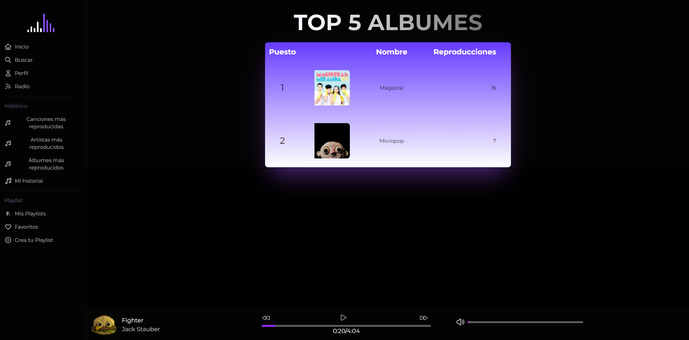

# 🎶 SoundStream

# Manual de Usuario

## ÍNDICE:

1. [Objetivos](#objetivos)
2. [Explicación y Descripción de la aplicación](#explicación-y-descripción-de-la-aplicación)
3. [Cómo utilizar la aplicación](#cómo-utilizar-la-aplicación)
    - [Usuario Subscriptor](#usuario-subscriptor)
        * [Ingresar a la plataforma](#1-ingresar-a-la-plataforma)
        * [Registro](#2-registro)
        * [Home](#3-home)
        * [Búsqueda](#4-búsqueda)
        * [Perfil](#5-perfil)
        * [Radio](#6-radio)
        * [Crea tu Playlist](#7-crea-tu-playlist)
        * [Mis Playlists](#8-mis-playlists)
        * [Agregando canciones a una playlist](#agregando-canciones-a-una-playlist)
        * [Eliminando canciones de una playlist](#eliminando-canciones-de-una-playlist)
        * [Favoritos](#favoritos)
        * [El Reproductor](#7-el-reproductor)
        * [Estadísticas (HISTORICO)](#8-estadísticas-historico)
            - [Canciones más reproducidas](#canciones-más-reproducidas)
            - [Artistas más escuchados](#artistas-más-escuchados)
            - [Albumes más escuchados](#albumes-más-escuchados)
            - [Mi historial](#mi-historial)
        * [Cerrar Sesión](#9-cerrar-sesión)

    - [Usuario Administrador](#usuario-administrador)
        * [CRUD Cancion](#crud-cancion)
        * [CRUD Artista](#crud-artista)
        * [CRUD Album](#crud-album)

## Objetivos:
### General:
Brindar al usuario una guía clara y completa para el uso de 'SoundStream' - una plataforma de streaming de música en línea, de modo que la experiencia de este sea satisfactoria, personalizada y conveniente, de tal manera que pueda efectivamente disfrutar de todas las características y funcionalidades que esta plataforma ofrece.

### Específicos:
1. Brindar una experiencia totalmente personalizable y única al usuario.
2. Explicar al usuario la manera de utilizar la plataforma para que este pueda registrarse, escuchar música, crear sus listas de reproducciones y demás.
3. Proporcionar información sobre problemas y/o dudas comunes que puedan surgir al utilizar la aplicación.
4. Informar al usuario administrador sobre el manejo correcto de la aplicación.

## Explicación y Descripción de la aplicación
Se presenta la plataforma denominada "SoundStream", una aplicación web en la nube - accesible de cualquier navegador, donde el usuario subscriptor podrá disfrutar de funciones tales como  reproducir canciones, guardar canciones favoritas, escuchar álbumes, crear sus propias playlists, ver la información sobre su artista favorito, realizar lo que son búsquedas y visualizar las estadísticas sobre su cuenta - además de poder personalizar su perfil y tener una experiencia adaptada a sus preferencias personales. Igualmente, si lo desea, también posee la oportunidad de descubrir nueva música y artistas por la función de radio. 
 
Adicionalmente, si el usuario posee el rol de administrador, no solo disfrutará las funcionalidades previamente mencionadas, sino que tendrá más control - esto por medio de las gestiones disponibles para las canciones, álbumes y artistas. Un adminstrador es capaz de agregar, editar, eliminar y visualizar con mejor detalle los anteriores puntos, lo que contribuye a una experiencia mejorada y completa.

## Cómo utilizar la aplicación
### _Usuario Subscriptor_
#### 1. Ingresar a la plataforma
Se le presenta a usted la siguiente pantalla al ingresar:
 

Si posee cuenta, podrá ingresar con su correo electrónico y contraseña, de lo contrario, deberá registrarse.

#### 2. Registro
Para poder registrarse, en la pantalla de inicio deberá de hacer click en la sección de **Regístrate aquí**. Una vez hecho esto, se le presentará la siguiente pantalla:
 

Deberá de llenar sus datos acorde al formulario:
- Nombres
- Apellidos
- Correo electrónico
- Fecha de nacimiento
- Contraseña
- Confirmar contraseña
- Seleccionar foto
Una vez completos sus datos, podrá clickear en el botón de **Registrar**.

Y aparecerá un mensaje:
 

Que cuando usted confirme, lo redirigirá a la pantalla de inicio de sesión par que posteriormente pueda ingresar a la plataforma.

#### 3. Home
Una vez que usted se haya registrado o ingresado a la plataforma, se le presentará la siguiente pantalla:
 

Dicha pantalla corresponde al Home, su página principal - puede entonces navegar por las diferentes secciones de la plataforma por la sidebar que se encuentra a la izquierda de la pantalla o si usted lo desea, permanecer en el Home, donde bastará con un click en alguna de las canción que se le presenta para empezar a reproducirla. Al bajar en esta misma panralla también se le presentarán los álbumes disponibles y los artistas.

Si usted hace click en algunos de los álbumes, se le redirigirá a la pantalla de dicho álbum, donde podrá ver las canciones que lo componen y reproducirlas:
 

O si selecciona algún artista, el perfil de este se le será presentado, donde podrá ver su información y las canciones que ha publicado:
 

Como puede visualizarse, tanto en la pantalla de álbumes como en la de artistas, las canciones son desglosadas y se le presenta la opción de reproducirlas, agregarlas a favoritos por medio del botón de corazón o agregarlas a una playlist por medio del botón de más.

#### 4. Búsqueda
Se le presenta en la Navbar la opción de _buscar_, donde la siguiente pantalla se le presentará:

En la cual usted podrá buscar canciones, álbumes y artistas por medio de la barra de búsqueda, y se le presentarán los resultados de su búsqueda, como se muestra en la siguiente imagen:

Las canciones puede usted reproducirlas por medio del botón de play que se le presenta, los  álbumes igualmente - además si a estos últimos junto con los artistas, usted hace click en ellos, se le redirigirá a la pantalla de dicho álbum o artista, donde podrá ver la información de estos y las canciones que los componen - como se mostró en la sección de _Home_.

#### 5. Perfil
En la Navbar se le presenta la opción de _perfil_, donde la siguiente pantalla se le presentará si usted hace click en ella:

Como puede verse, usted es capaz de editar y actualizar su información una vez hace click en el botón de _Editar_, donde se le presentará el siguiente formulario:

#### 6. Radio
En la Navbar se le presenta la opción de _radio_, donde todas las canciones disponibles se le serán presentadas y de manera aleatoria, se reproducirán:

#### 7. Crea tu Playlist
En esta sección, usted podrá configurar y crear una nueva playlist - donde podrá agregar canciones, editar su información y eliminarla. Para ello, en la Navbar se le presenta la opción de _Crea tu Playlist_, donde la siguiente pantalla se le presentará si usted hace click en ella:

Si usted llena el formulario se verá de la siguiente manera:

Y una vez usted cree la playlist, se le presentará la siguiente pantalla:

#### 8. Mis Playlists
Se le presentará la siguiente pantalla si usted hace click en la opción de _Mis Playlists_ en la Navbar:

Donde usted podrá acceder a las playlists que ha creado y reproducirlas:

#### _Agregando canciones a una playlist_:
Para agregar canciones a una playlist, usted deberá de hacer click en el botón de _más_ que se le presenta cada vez que se lista una canción, una vez lo haga, se le presentará la siguiente opción:
 

Donde en el dropdown menu, usted deberá de seleccionar la playlist a la que desea agregar la canción y hacer click en el botón de _Agregar_. Si el proceso ha sido completado exitosamente, se le presentará el siguiente mensaje:
 

Y cuando revise la playlist, la canción se encontrará agregada:
 

#### _Eliminando canciones de una playlist_:
Si ya no desea que una canción se encuentre en una playlist, usted deberá de hacer click derecho sobre la canción a eliminar:
 

 

Y deberá de seleccionar la opción de _Eliminar de la playlist_, una vez lo haga, la canción se eliminará de su playlist.
 

 

#### _Favoritos_:
Para agregar una canción a favoritos, bastará con hacer click al corazón que se le presenta cada vez que se lista una canción:

#### 7. El Reproductor
Una vez ya descritas las maneras de interactuar con las canciones, se presenta el reproductor, el cual se encuentra en la parte inferior de la pantalla. Una vez usted decida reproducir una canción, esta empezará a sonar y se le presentará la siguiente pantalla:

Como puede notar, es posible visualizar el nombre del artista, nombre de la canción al igual que su respectiva imagen. Podrá usted:
* Pausar la canción
* Reanudar la canción
* Avanzar a la siguiente canción
* Retroceder a la canción anterior
* Elegir por medio de la barra de progreso, el punto de la canción en el que desea reproducir
* Ajustar el volumen de la canción

#### 8. Estadísticas (HISTORICO)
Existen 4 tipos de estadísticas que se le presentan al usuario, las cuales son:
1. Canciones más reproducidas: Un top 5 de las canciones más escuchadas por el usuario.
2. Artistas más escuchados: Un top 3 de los artistas más escuchados por el usuario.
3. Albumes más escuchados: Un top 5 de los albumes más escuchados por el usuario.
4. Mi historial: Una recolección histórica de las canciones que el usuario ha escuchado.

Para acceder a estas estadísticas, deberá de hacer click cualquiera de las opciones bajo _Histórico_ en la Navbar.

#### Canciones más reproducidas

En esta sección, se le presentará un top 5 de las canciones más escuchadas por el usuario, donde se le mostrará el nombre de la canción, puesto, su imagen y el total de reproducciones.

#### Artistas más escuchados

En esta sección, se le presentará un top 3 de los artistas más escuchados por el usuario, donde se le mostrará el nombre del artista, puesto, su imagen y el total de reproducciones.

#### Albumes más escuchados

En esta sección, se le presentará un top 5 de los albumes más escuchados por el usuario, donde se le mostrará el nombre del album, puesto, su imagen y el total de reproducciones.

#### Mi historial

En esta sección, se le presentará un historial de las canciones que el usuario ha escuchado, brindando información como el nombre de la canción, el artista, el album, la duración y hace cuánto tiempo la canción se reprodujo.

#### 9. Cerrar Sesión
Para cerrar sesión, deberá de hacer click en la opción de Salida que aparece en la parte superior derecha de la pantalla:

### _Usuario Administrador_
Como se mencionó anteriormente, el usuario administrador posee las mismas funcionalidades que el usuario subscriptor, pero además, posee la capacidad de gestionar las canciones, álbumes y artistas. Para ello, en la Navbar se le presenta la opción nueva de _Funcionalidades CRUD_, donde la siguiente pantalla se le presentará si usted hace click en ella:

#### CRUD Cancion
Se le presentará la siguiente pantalla si usted hace click en la opción de _CRUD Cancion_:

Donde usted podrá agregar, editar, eliminar y visualizar las canciones que se encuentran en la plataforma.
*_Agregar_*:
Para agregar una canción, deberá de hacer click en el botón de _Agregar Canción_, donde se le presentará el siguiente formulario:

> Nota: Para agregar una canción, deberá de tener previamente un artista.
> Espere a que la canción se haya subido correctamente, esto puede tardar unos segundos, al igual que la imagen.

Una vez llena la información, deberá de hacer click en el botón de _Guardar_.

*_Actualizar_*:
Es posible actualizar los datos de una canción, para ello, deberá de hacer click en el botón amarillo de _Actualizar_ que se le presenta y con esto, se le presentará el siguiente formulario:

*_Delete_*:
Es posible eliminar una canción, para ello, deberá de hacer click en el botón rojo de _Eliminar_ que se le presenta y con esto, se le presentará el siguiente mensaje:

Donde usted deberá de ingresar su contraseña de administrador y hacer click en el botón de _Eliminar_, si es correcta - la canción será eliminada.

*_Detalle_*:
Es posible ver el detalle de una canción, para ello, deberá de hacer click en el botón azul de _Detalle_ que se le presenta y con esto, se le presentará lo siguiente:

#### CRUD Artista
La parte de gestión de artistas es similar a la de canciones, para acceder a ella, deberá de hacer click en la opción de _CRUD Artista_ en la Navbar, donde la siguiente pantalla se le presentará:

Donde usted podrá agregar, editar, eliminar y visualizar los artistas que se encuentran en la plataforma.
*_Agregar_*:
Para agregar un artista, deberá de hacer click en el botón de _Agregar Artista_, donde se le presentará el siguiente formulario:

> Nota: Espere a que la foto del artista se haya subido correctamente, esto puede tardar unos segundos.

Una vez llena la información, deberá de hacer click en el botón de _Guardar_.

*_Actualizar_*:
Es posible actualizar los datos de un artista, para ello, deberá de hacer click en el botón amarillo de _Actualizar_ que se le presenta y con esto, se le presentará el siguiente formulario:

*_Delete_*:
Es posible eliminar un artista, para ello, deberá de hacer click en el botón rojo de _Eliminar_ que se le presenta y con esto, se le presentará el siguiente mensaje:

Donde usted deberá de ingresar su contraseña de administrador y hacer click en el botón de _Eliminar_, si es correcta - el artista será eliminado.

*_Detalle_*:
Es posible ver el detalle de un artista, para ello, deberá de hacer click en el botón azul de _Detalle_ que se le presenta y con esto, se le presentará lo siguiente:

#### CRUD Album
El CRUD de albumes es similar al de canciones y artistas, aunque posee una opción extra denominada _Agregar Canción_ - la cual se explicará más adelante, para acceder a el CRUD, deberá de hacer click en la opción de _CRUD Album_ en la Navbar, donde la siguiente pantalla se le presentará:

Donde usted podrá agregar, editar, eliminar y visualizar los albumes que se encuentran en la plataforma.

*_Agregar_*:
Para agregar un album, deberá de hacer click en el botón de _Agregar Album_, donde se le presentará el siguiente formulario:

> Nota: Para agregar un album, deberá de tener previamente un artista.
> Espere a que la foto del album se haya subido correctamente, esto puede tardar unos segundos.

Una vez llena la información, deberá de hacer click en el botón de _Guardar_.

*_Actualizar_*:
Es posible actualizar los datos de un album, para ello, deberá de hacer click en el botón amarillo de _Actualizar_ que se le presenta y con esto, se le presentará el siguiente formulario:

*_Delete_*:

Es posible eliminar un album, para ello, deberá de hacer click en el botón rojo de _Eliminar_ que se le presenta y con esto, se le presentará el siguiente mensaje:

Donde usted deberá de ingresar su contraseña de administrador y hacer click en el botón de _Eliminar_, si es correcta - el album será eliminado.

*_Detalle_*:
Es posible ver el detalle de un album, para ello, deberá de hacer click en el botón azul de _Detalle_ que se le presenta y con esto, se le presentará lo siguiente:

*_Agregar Canción_*:
Es posible agregar o eliminar una canción a un album, para ello, deberá de hacer click en el botón verde de _Agregar Canción_ que se le presenta y con esto, se le presentará lo siguiente:

Donde podrá elegir entre las canciones de un artista que no se encuentren en el album, y agregarlas a este.

